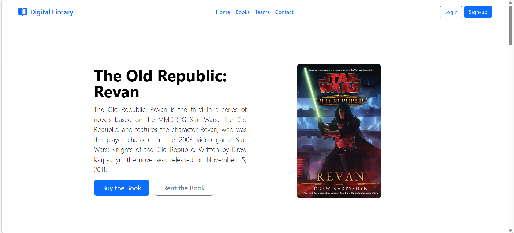

# Tugas React Pertemuan Satu

Pada tugas react pertemuan satu, adalah membuat sebuah landing page website perpustakaan, pada landing page menampilkan buku pilihan, buku-buku yang tersedia pada seri tertentu, team pembuat website, dan kontak.

## Menjalankan Websitenya

Untuk menjalankan websitenya, pastikan Anda telah memiliki `node`, setelah itu clone repositori ini, setelah Anda clone, Anda dapat menjalankan command `npm install` untuk mendapatkan depedency yang diperlukan, dan setelah itu menjalankan command `npm run dev`.

## Screenshot

